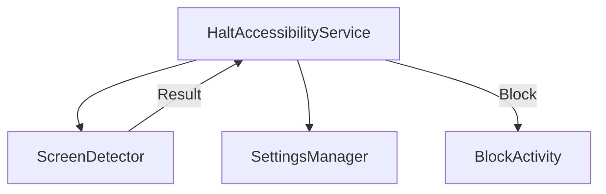

# PRD – Halt 🛑

**Kill Infinite Scrolling at the OS Level**

---

## 1. Product Overview

### Problem

Infinite scrolling apps (Instagram Reels, Explore, YouTube Shorts, LinkedIn feed, Twitter, Snapchat) exploit attention loops, causing time loss and reduced focus.

Android does not provide native controls to block specific app sections (like Reels). Existing digital wellbeing tools are app-level, not **screen-level**.

---

## 2. Goals & Success Criteria

### Primary Goal

Prevent users from entering infinite scrolling feeds while allowing intentional consumption.

### Status: ✅ IMPLEMENTED

* **Instagram Reels**: BLOCKED
* **Instagram Explore**: BLOCKED
* **Browser Shorts/Reels**: BLOCKED
* **Intentional Use (DMs)**: ALLOWED
* **Pause / Strict Mode**: IMPLEMENTED

---

## 3. Core Functional Requirements

---

### FR-1: Detect Active App

The system detects which app is currently in the foreground.

**Implementation (Actual)**
* `HaltAccessibilityService` checks `event.packageName`.
* Supports: Instagram, Chrome, Firefox, Samsung Internet.

---

### FR-2: Detect Infinite Scrolling Screens

The system detects Reels and Explore screens using `ScreenDetector`.

**Detection Strategy**
* **Reels**: Checks for "Reels" text nodes.
* **Explore**: Checks for "Search" text + "Explore" context or scrolling events.
* **Browsers**: Scans for URLs like `youtube.com/shorts` or `instagram.com/reels`.

---

### FR-3: Block Entry via UI Buttons

If user clicks Reels / Explore button → block immediately.

---

### FR-4: Allow Content Opened via DM / Link

If a reel/video is opened via message or deep link → allow access.

**Logic (Implemented)**
* Checks for "sent you" text triggers.
* DM context is checked *before* blocking logic.

---

### FR-5: Overlay Blocking Screen

When blocked, the user must not interact with the feed.

**Implementation**
* `BlockActivity` launched with `FLAG_ACTIVITY_NEW_TASK`.
* "Take a breath" UI.

---

### FR-6: Pause or Strict Mode

**Implemented Features**:
* **Pause**: Allow 15 minutes of usage.
* **Strict Mode**: Hides the "Pause" button in Settings.
* **Persistence**: Managed via `SettingsManager` (SharedPreferences).

---

### FR-7: Browser Shorts Blocking

Short-form URLs opened in browsers are blocked.

**Supported Browsers**:
* Chrome (`com.android.chrome`)
* Firefox (`org.mozilla.firefox`)
* Samsung Internet (`com.sec.android.app.sbrowser`)

---

## 8. UI / UX

### Screens (Implemented)

**Home (`MainActivity`)**
* Service Status (Active/Inactive).
* Permission Grants.
* Settings Entry.

**Block Overlay (`BlockActivity`)**
* Reason shown (e.g., "Reels Blocked").
* Back button.

**Settings (`SettingsActivity`)**
* Strict Mode Toggle.
* Pause Button (15m).

---

## 9. Technical Architecture

**Components**:
* `HaltAccessibilityService`: Main entry point.
* `ScreenDetector`: Pure logic class for analyzing `AccessibilityNodeInfo`.
* `SettingsManager`: Handles `SharedPreferences`.

---

## 14. Definition of Done

* [x] Instagram Reels blocked
* [x] Instagram Explore blocked
* [x] Browser Shorts blocked
* [x] No accidental blocking of DMs
* [x] App runs silently
