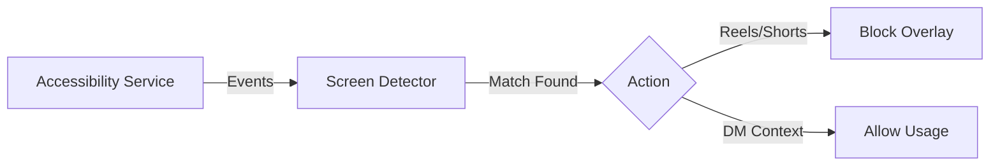

# Halt 🛑

> **Reclaim your attention.**
> A native Android utility that kills infinite scrolling at the OS level.


**Halt** is not just another app blocker. It is a precise, intent-aware filter for your digital diet. By leveraging Android's **Accessibility Services**, Halt surgically disables "doomscrolling" features (like Instagram Reels, Explore, and YouTube Shorts) while keeping the core utility of these platforms (Messaging, Search) fully accessible.

---

## ⚡ Why Halt?

Digital wellness tools often fail because they are too blunt. They block the entire app, cutting you off from essential communication.

**Halt is different.**
*   **Precision:** Blocks *Reels*, not *Instagram*. Blocks *Shorts*, not *YouTube*.
*   **Intent-Aware:** Allows video content if it was sent to you in a Direct Message.
*   **Browser-Proof:** Detects and blocks short-form video URLs even in Chrome or Firefox.

---

## ✨ Key Features

| Feature | Status | Description |
| :--- | :---: | :--- |
| **Reels Blocker** | ✅ | Instantly detects and overlays the Instagram Reels interface. |
| **Explore Blocker** | ✅ | Prevents mindless scrolling on the Search/Explore grid. |
| **Shorts Blocker** | ✅ | Blocks `youtube.com/shorts` in supported browsers. |
| **Smart DMs** | ✅ | **Intelligent Exception**: Allows viewing content shared via DMs. |
| **Pause Mode** | ✅ | Take a break. Pause blocking for 15 minutes. |
| **Strict Mode** | 🚧 | Prevents disabling the service or pausing (In Progress). |

---

## 🛠️ Architecture

Halt operates as a silent background service involving three core components:



*   **`HaltAccessibilityService`**: The engine binding to the OS.
*   **`ScreenDetector`**: A heuristic engine that parses UI hierarchies and URLs.
*   **`SettingsManager`**: Manages state, pauses, and strict mode preferences.

👉 [View Full Architecture Diagram](Diagrams/architecture.mmd)

---

## 🚀 Getting Started

### Prerequisites
*   Android Studio (Hedgehog or newer)
*   Physical Android Device (Emulator support is limited for Accessibility)
*   Min SDK: 26 (Android 8.0)

### Installation

1.  **Clone the repository**:
    ```bash
    git clone https://github.com/yourusername/halt.git
    ```
2.  **Open in Android Studio** and sync Gradle.
3.  **Build & Run** on your device.

### Setup on Device
Upon first launch, you must grant two critical permissions:
1.  **Display Over Other Apps**: Needed to show the "Take a breath" overlay.
2.  **Accessibility Service**: Needed to read screen content to detect blocking targets.

---

## 📖 Documentation

*   **[Product Requirements Doc (PRD)](Guides/PRD.md)**: The full vision and detailed requirements.
*   **[Block Logic Guide](Guides/BLOCK_LOGIC.md)**: Deep dive into how the detection algorithms work effectively.
*   **[Testing Guide](Guides/TESTING.md)**: Step-by-step instructions for verifying features.

---

## 🛡️ Privacy & Permissions

**Halt respects your privacy.**
*   **No Internet Permission**: The app does not request `INTERNET` access in its Manifest.
*   **Local Processing**: All screen analysis happens instantly on-device. No data leaves your phone.
*   **Open Source**: You can inspect the transparency of the `ScreenDetector` logic yourself.

---

## 🤝 Contributing

Contributions are welcome! Please read the [BLOCK_LOGIC.md](Guides/BLOCK_LOGIC.md) first to understand the detection philosophy.

1.  Fork the project.
2.  Create your feature branch (`git checkout -b feature/AmazingFeature`).
3.  Commit your changes (`git commit -m 'Add some AmazingFeature'`).
4.  Push to the branch (`git push origin feature/AmazingFeature`).
5.  Open a Pull Request.

---

**Halt** — *Stop scrolling. Start living.*
