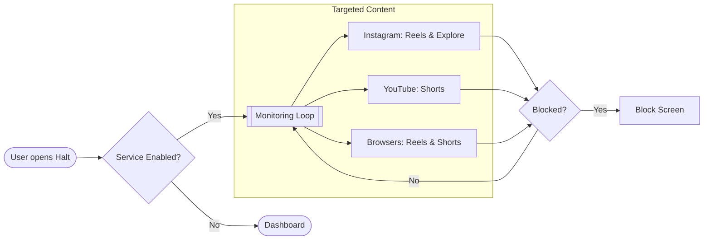

# Halt

> **Reclaim your attention.**
> A native Android utility that manages infinite scrolling at the OS level.


Halt is a precision-engineered utility designed to manage digital consumption. By utilizing Android's Accessibility Services, Halt implements surgical filters for features such as Instagram Reels, Explore, and YouTube Shorts. Unlike traditional application blockers, Halt preserves core functionality, such as messaging and search, while restricting addictive interface elements.

---

## Compatibility

Halt provides native support for high-consumption applications and widely used mobile browsers.

| Category | Supported Platforms |
| :--- | :--- |
| **Applications** | Instagram, YouTube |
| **Web Browsers** | Google Chrome, Samsung Internet, Mozilla Firefox |

---

## Technical Advantages

Traditional digital wellness tools are often imprecise, blocking entire applications and disrupting essential communications.

**Halt provides a more granular approach:**
*   **Precision Blocking:** Targets specific components like Reels and Shorts rather than the entire application.
*   **Contextual Awareness:** Allows content viewed within appropriate contexts, such as direct messages.
*   **Multi-Platform Detection:** Identifies and manages short-form video content within supported browsers.

---

## System Architecture



👉 [Technical Architecture Details](Diagram/architecture.mmd)

---

## Features and Status

| Feature | Status | Description |
| :--- | :---: | :--- |
| **Reels Management** | Complete | Detects and manages the Instagram Reels interface. |
| **Explore Management** | Complete | Prevents scrolling on the Explore grid. |
| **Shorts Management** | Complete | Manages YouTube Shorts in supported browsers and applications. |
| **Contextual Exceptions** | Complete | Intelligent handling of content shared via direct messages. |
| **Intervention Overlays** | Complete | Dynamic overlays designed to interrupt scrolling habits. |
| **Administrative UI** | Complete | Professional dashboard for configuration. |
| **Pause Functionality** | Complete | Temporary suspension of management for defined intervals. |
| **Strict Mode** | In Progress | Enhanced safeguards against service deactivation. |

---

## Implementation

### Prerequisites
*   Android Studio (Hedgehog or newer)
*   Physical Android Device (Accessibility features are best tested on hardware)
*   Minimum SDK: 26 (Android 8.0)

### Installation

1.  **Clone the repository**:
    ```bash
    git clone https://github.com/yourusername/halt.git
    ```
2.  **Open in Android Studio** and synchronize the Gradle configuration.
3.  **Build and deploy** to your device.

### Device Configuration
Initial setup requires the following permissions:
1.  **Display Over Other Apps**: Enables the intervention overlay.
2.  **Accessibility Service**: Enables UI hierarchy analysis for detection.

---

## Documentation

*   **[Product Requirements Document (PRD)](Guides/PRD.md)**: Vision and functional requirements.
*   **[Logic Implementation Guide](Guides/BLOCK_LOGIC.md)**: Technical detail on detection algorithms.
*   **[Verification Procedures](Guides/TESTING.md)**: Manual and automated testing protocols.

---

## Privacy and Security

Halt is designed with a focus on user privacy:
*   **Local Execution**: All analysis occurs locally on the device.
*   **No Network Access**: The application does not request internet permissions.
*   **Code Transparency**: The detection logic is open for independent review.

---

Halt — Stop scrolling. Start living.
